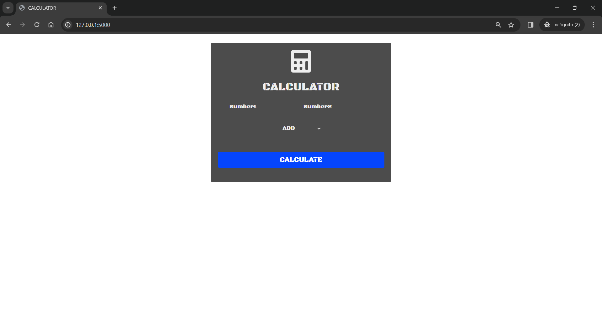

## Example Python Web Calculator

### Author: RafaelTorices

This is a simple example of a web calculator using Python and Flask.

> **Note:**
> The application can be updated with new mathematical functions, such as square root, percentages, etc.



### Prerequisites

- Python 3.6 or higher

### Installing

1. Clone the repository
2. Install the requirements

```
    pip install -r requirements.txt
```

3. Run the application

```
    python calculator.py
```

4. Open the browser and go to http://localhost:5000

5. Enjoy!
